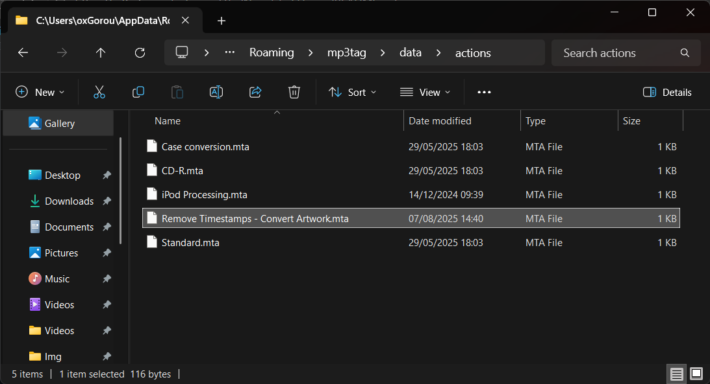
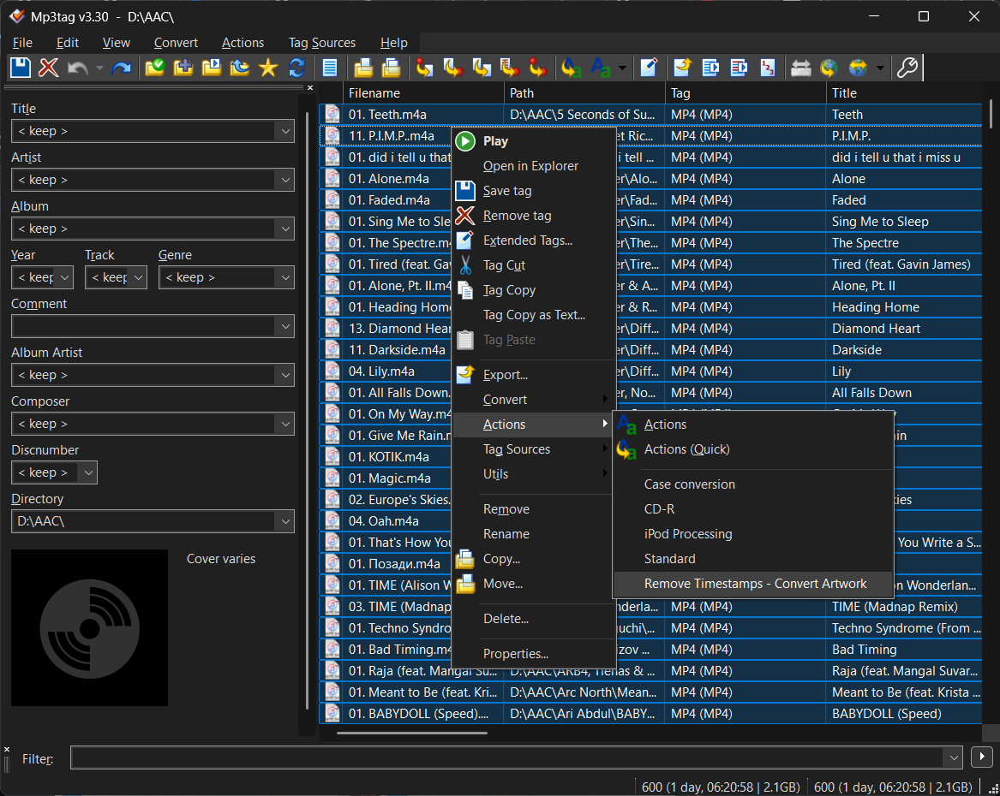
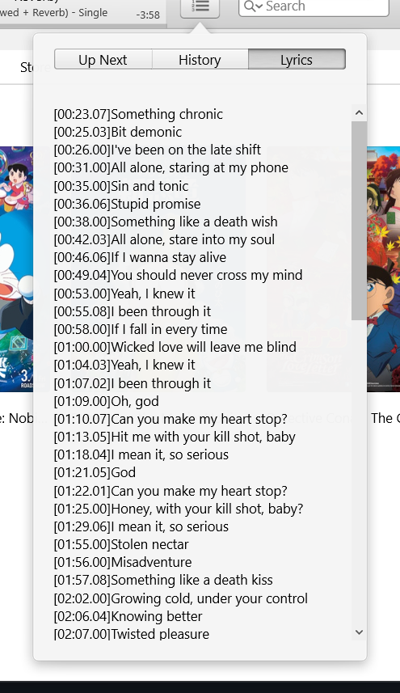
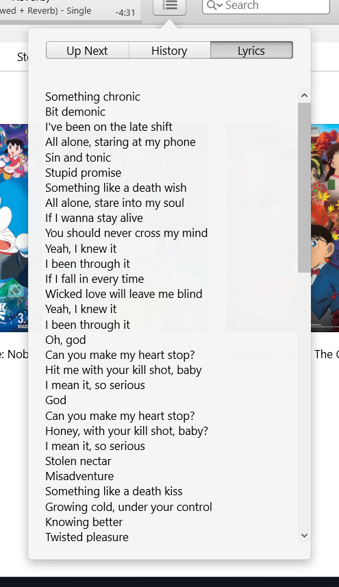

# My Ultimate Experience w/ iPod Nano 5

  
  

---

## Specifications  

- **Model:** iPod Nano 5th Gen, 16GB (White)  
- **Model Number:** A1320  

---

## Guides  

- **Download ALAC files from Apple Music**  
  You can use your own music source, but I recommend **Apple Music** to get full metadata and better tagging management for the iPod later.  
  - [Apple Music Wrapper on WSL](https://telegra.ph/Apple-Music-Wrapper-On-WSL1-07-21)  
  - [MP3Tag](https://www.mp3tag.de/en/download.html) – use my config to optimize cover art and remove lyrics timestamps  

- **Convert ALAC to AAC**  
  Keep your original ALAC files, then convert them to AAC using:  
  - [iPod Encode AAC Audio Tracks](https://github.com/Olsro/reddit-ipod-guides/blob/main/guides/encode-audio-tracks-oldapple.md)  

- **Adding Movies / Videos / Games**  
  - [iPod Clickwheel Games Preservation Project](https://github.com/Olsro/ipodclickwheelgamespreservationproject)  
  - [iPod Encode 240P Video Content](https://github.com/Olsro/reddit-ipod-guides/blob/main/guides/ipod-encode-240p-video-content.md)  

---

## Recommended Settings  

For better battery life and smoother experience on the iPod:  

- **Audio Crossfade:** Off  
- **Sound Check (iTunes + iPod):** On  
  - Alternatively, you can use **MP3Tag** to normalize all tracks to equal dB levels.  

---

## Processing AAC Files with MP3Tag  

When downloading ALAC files from Apple Music and converting them to AAC, you may notice issues such as timestamps in lyrics (e.g. `[xx:xx.xx] Lyrics line`) since the iPod does not support **Live Lyrics** or **Synced Lyrics**.  

To fix this:  

- Remove timestamps from lyrics  
- Resize cover art to **500x500 JPEG** for better storage efficiency  

### Steps:  

1. Download my processing config from **Release**.  
2. Press **Win + R** and type:  
`%appdata%\mp3tag\data\actions`
3. Paste `Remove Timestamps - Convert Artwork.mta` into that folder.  

  

4. Open **MP3Tag** and drag your AAC folder or files into the window.  
5. Select all AAC files → Right-click → `Actions` → **Remove Timestamps - Convert Artwork**.  

  

---

### Before vs After  

 

---
